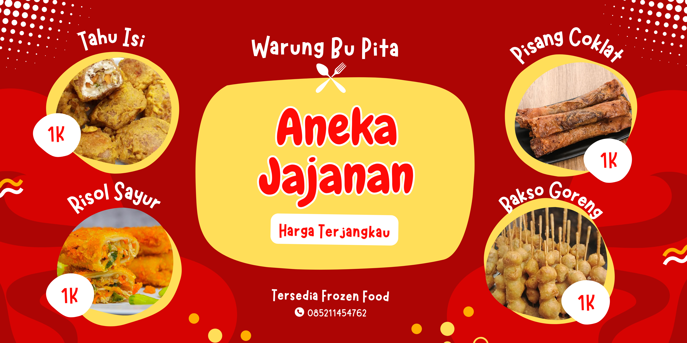

  

<h1 align="center">Pengembangan Digital Twin UMKM Warung Bu Pita</h1>

  Monitoring produksi, persediaan, dan penjualan untuk usaha jajanan skala kecil

  
  
  
  
  
  
  
  

  
  
  

---

## Tentang Proyek

Repository ini berisi dokumentasi dan hasil pengerjaan proyek Digital Twin untuk **Warung Bu Pita**, UMKM yang menjual aneka jajanan seperti tahu isi, risol sayur, pisang coklat, dan bakso goreng, serta menyediakan frozen food.

Pencatatan produksi, stok bahan, dan penjualan di warung masih dilakukan secara manual, sehingga pemilik sulit melihat kondisi usaha secara utuh. Digital Twin dipakai sebagai representasi digital dari kondisi warung yang diperbarui dengan data aktual, agar aktivitas usaha bisa dipantau lebih terstruktur.

  

<!-- ═══════════════════════════════════════ -->
<!-- 🍟 RUANG LINGKUP PROYEK -->
<!-- ═══════════════════════════════════════ -->

<h2>🍟 Ruang Lingkup Proyek</h2>

  
  
  

<table>
  <thead>
    <tr>
      <th align="center">
        
      </th>
      <th>
        
      </th>
      <th>
        
      </th>
    </tr>
  </thead>
  <tbody>
    <tr>
      <td align="center">🏭 <strong>Produksi</strong></td>
      <td>Jumlah produksi harian per menu</td>
      <td>Produksi lebih terencana dan tidak berlebih</td>
    </tr>
    <tr>
      <td align="center">📦 <strong>Persediaan</strong></td>
      <td>Stok bahan baku dan barang jadi</td>
      <td>Stok menipis diketahui lebih awal</td>
    </tr>
    <tr>
      <td align="center">📊 <strong>Penjualan</strong></td>
      <td>Jumlah terjual per menu</td>
      <td>Menu yang laris dan yang sepi mudah terlihat</td>
    </tr>
  </tbody>
</table>

  ✦ Dari dapur hingga penjualan, semuanya terpantau ✦

 

<!-- ═══════════════════════════════════════ -->
<!-- 🥡 RENCANA PENGEMBANGAN -->
<!-- ═══════════════════════════════════════ -->

<h2>🥡 Rencana Pengembangan</h2>

  
  
  

<table>
  <thead>
    <tr>
      <th>
        
      </th>
      <th>
        
      </th>
      <th>
        
      </th>
    </tr>
  </thead>
  <tbody>
    <tr>
      <td>📝 <strong>Perencanaan</strong></td>
      <td>Menyusun ruang lingkup, pihak terkait, dan rincian pekerjaan</td>
      <td>Project Charter, Stakeholder Register, WBS</td>
    </tr>
    <tr>
      <td>🔎 <strong>Analisis Kebutuhan</strong></td>
      <td>Mengamati alur kerja warung dan mengumpulkan data produksi, stok, dan penjualan</td>
      <td>Daftar kebutuhan dan alur proses</td>
    </tr>
    <tr>
      <td>📐 <strong>Perancangan</strong></td>
      <td>Merancang model Digital Twin untuk tiga aspek yang dipantau</td>
      <td>Rancangan model dan struktur data</td>
    </tr>
    <tr>
      <td>🛠️ <strong>Pengembangan</strong></td>
      <td>Membangun pencatatan data dan tampilan monitoring</td>
      <td>Prototipe sistem</td>
    </tr>
    <tr>
      <td>🧪 <strong>Pengujian</strong></td>
      <td>Mencoba prototipe dengan data nyata dari warung</td>
      <td>Hasil uji dan catatan perbaikan</td>
    </tr>
    <tr>
      <td>🎯 <strong>Evaluasi</strong></td>
      <td>Menilai manfaat sistem bagi pemilik dan menyusun laporan akhir</td>
      <td>Laporan proyek</td>
    </tr>
  </tbody>
</table>

  ✦ Planning → Designing → Developing → Improving ✦

 

<!-- ═══════════════════════════════════════ -->
<!-- 🌟 STATUS PROGRES -->
<!-- ═══════════════════════════════════════ -->

<h2>🌟 Status Progres</h2>

  
  
  
  

<table>
  <thead>
    <tr>
      <th>
        
      </th>
      <th align="center">
        
      </th>
      <th>
        
      </th>
    </tr>
  </thead>
  <tbody>
    <tr>
      <td><strong>Perencanaan</strong></td>
      <td align="center">
        
      </td>
      <td>Project Charter, Stakeholder Register, WBS, dan Function Point sudah tersedia</td>
    </tr>
    <tr>
      <td><strong>Analisis Kebutuhan</strong></td>
      <td align="center">
        
      </td>
      <td>Pengumpulan data produksi, stok, dan penjualan dari warung</td>
    </tr>
    <tr>
      <td><strong>Perancangan</strong></td>
      <td align="center">
        
      </td>
      <td>Rancangan model Digital Twin dan struktur data</td>
    </tr>
    <tr>
      <td><strong>Pengembangan</strong></td>
      <td align="center">
        
      </td>
      <td>Model 3D, pencatatan data, dan tampilan monitoring</td>
    </tr>
    <tr>
      <td><strong>Pengujian</strong></td>
      <td align="center">
        
      </td>
      <td>Uji prototipe dengan data nyata</td>
    </tr>
    <tr>
      <td><strong>Evaluasi</strong></td>
      <td align="center">
        
      </td>
      <td>Penilaian manfaat dan laporan akhir</td>
    </tr>
  </tbody>
</table>

  ✦ A little progress every day adds up ✦

 

<!-- ═══════════════════════════════════════ -->
<!-- 🍡 RENCANA FITUR -->
<!-- ═══════════════════════════════════════ -->

<h2>🍡 Rencana Fitur</h2>

  
  

<table>
  <thead>
    <tr>
      <th align="center">✦</th>
      <th>
        
      </th>
    </tr>
  </thead>
  <tbody>
    <tr>
      <td align="center">🏠</td>
      <td>Model 3D warung dengan area produksi, persediaan, dan penjualan</td>
    </tr>
    <tr>
      <td align="center">📝</td>
      <td>Form pencatatan produksi, stok bahan, dan penjualan harian</td>
    </tr>
    <tr>
      <td align="center">🖥️</td>
      <td>Tampilan 3D yang berubah mengikuti data</td>
    </tr>
    <tr>
      <td align="center">📈</td>
      <td>Grafik produksi dan penjualan per menu</td>
    </tr>
    <tr>
      <td align="center">🔔</td>
      <td>Peringatan saat stok bahan menipis</td>
    </tr>
    <tr>
      <td align="center">🔮</td>
      <td>Prediksi stok habis dan rekomendasi jumlah produksi</td>
    </tr>
    <tr>
      <td align="center">🔌</td>
      <td>Pengembangan lanjutan: data dari sensor atau kasir digital</td>
    </tr>
  </tbody>
</table>

  ✦ Small ideas, bigger possibilities for Warung Bu Pita ✦

## Teknologi dan Tools

  

| Kategori | Nama | Penggunaan dalam proyek | Status |
|----------|------|-------------------------|:------:|
| Version Control | [Git](https://git-scm.com/) dan [GitHub](https://github.com/) | Menyimpan dokumen, mencatat perubahan, dan kolaborasi tim | Digunakan |
| Desain Visual | [Canva](https://www.canva.com/) | Membuat spanduk dan materi visual proyek | Digunakan |
| Kolaborasi Tim | [Lark](https://www.larksuite.com/) | Koordinasi tim, pembagian tugas, dan catatan pekerjaan | Digunakan |
| Backend | [Node.js](https://nodejs.org/) | Menjalankan JavaScript di sisi server dan alat pengembangan web | Direncanakan |
| Pemodelan 3D | [Blender](https://www.blender.org/) | Membuat model 3D warung dan produk | Direncanakan |
| Tampilan Web | [Three.js](https://threejs.org/) dan [React](https://react.dev/) | Menampilkan model 3D dan grafik di browser | Direncanakan |
| Database | [Supabase](https://supabase.com/) | Menyimpan data produksi, stok, dan penjualan | Direncanakan |

## Anggota Kelompok

  

  <a href="https://github.com/chikadena">@chikadena</a> ·
  <a href="https://github.com/Mfirdaus809">@Mfirdaus809</a> ·
  <a href="https://github.com/nazwa-daraa">@nazwa-daraa</a> ·
  <a href="https://github.com/irmalgs048-coder">@irmalgs048-coder</a>

## Dokumentasi

| Dokumen | Lokasi |
|---------|--------|
| Project Charter | [Digital Twin UMKM Warung Bu Pita](<./Digital Twin UMKM Warung Bu Pita>) |
| Stakeholder Register | [Digital Twin UMKM Warung Bu Pita](<./Digital Twin UMKM Warung Bu Pita>) |
| Work Breakdown Structure (WBS) | [Digital Twin UMKM Warung Bu Pita](<./Digital Twin UMKM Warung Bu Pita>) |
| Function Point | [Digital Twin UMKM Warung Bu Pita](<./Digital Twin UMKM Warung Bu Pita>) |

---

  Repository ini dibuat untuk keperluan tugas perkuliahan MPPL 2026.

